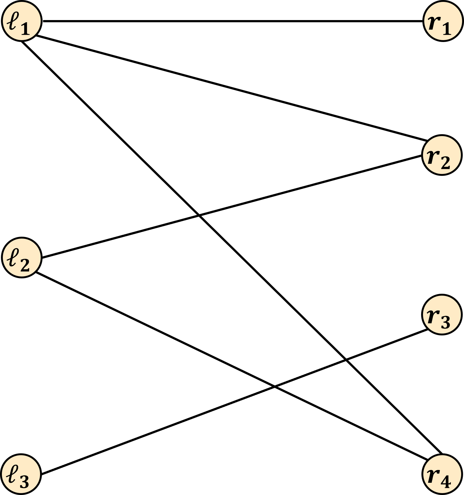
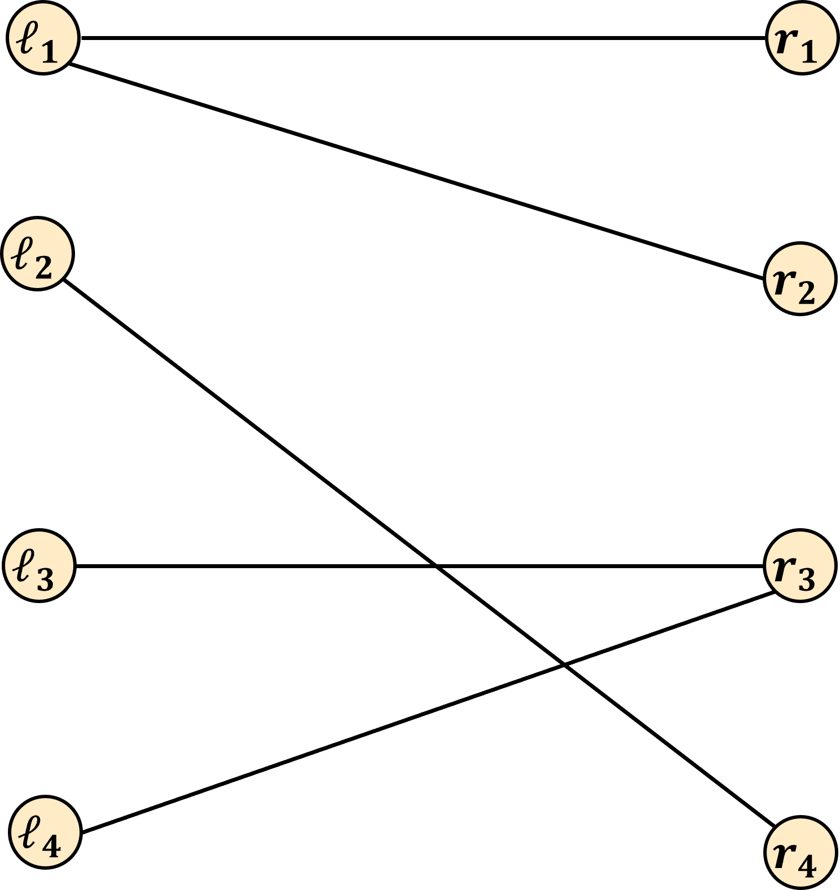

---
title: Bipartite Matching
...

This represents our last reading about Max Flow. Starting with last class, we began looking at how we can transform problems that seem unrelated to max flow into flow networks so that we can use Ford-Fulkerson to solve them. We'll continue discussing more examples of this for our coming lecture, and this reading will introduce a problem called *maximum bipartite matching*.

# Defining Maximum Bipartite Matching

## Matching

We've seen a few different definitions of "matching" before. We talked about *perfect matching* and *stable matching* at the beginning of the quarter when learning the Gale-Shapley algorithm. Overall, a matching is simply a way of pairing up elements from two sets. A perfect matching is specifically a way of doing this such that every member of each set belongs to exactly one pair. A stable matching is a matching that has no unstable pairs (no unmatched pair that prefer one another over their current partners).

We next introduce a *bipartite matching*. Because it's called a "matching", we can anticipate that our objective will be to pair things up. So next we need to discuss what "bipartite" means

## Bipartite

The word "bipartite" means having two parts. For the maximum bipartite matching problem, this adjective specifically describes a graph. We say an undirected graph is bipartite provided its vertices can be partitioned (split into 2 parts) such that no two nodes in the same set share an edge. In other words, a graph is bipartite if we can identify a cut in the graph such that all edges cross the cut.

Formally, a bipartite graph $G=(V,E)$ is a graph whose set of vertices $V$ can be partitioned into two sets $L$ and $R$ (for "left" and "right") such that $L \cup R = V$ and $E \subset L \times R$.

## Bipartite Matching

Now we can combine these two ideas. A matching is a way of pairing up elements from two sets. A bipartite graph is a graph whose nodes can be split into two sets $L$ and $R$ where there are no edges between nodes in the same set. A bipartite matching is then going to refer to some way of pairing up nodes from $L$ and $R$. Specifically, the definition of a bipartite matching is a way of pairing up adjacent nodes in a bipartite graph such that each node participates in at most one pair (and so we can only pair an element of $L$ with an element of $R$ if those nodes share an edge).

### Dog Adoption Example 

As a motivating application, we could consider an animal shelter that is trying to find forever homes for the dogs it has available for adoption. We will form a graph where there is a node for each dog, and a node for each family that's interested in adoption. We can then draw an edge between a dog and a family if the shelter feels that they are compatible (e.g. the family has said that they would like to adopt the dog, and the shelter agrees that the dog will fit in well at that home). 

The resulting graph will certainly be bipartite where $L$ is the set of families and $R$ is the set of dogs (or vice-versa). This is bipartite because no dog will have an edge to another dog (since dogs can't adopt other dogs, silly!), and no family will have an edge to another family (this is an animal shelter, so they can only help with adopting animals). A bipartite matching would then be any pairing up of families with compatible dogs such that no dog is adopted by multiple families and no family adopts multiple dogs. Note that this does not need to be a perfect matching, meaning that it could be that some families may not end up adopting any dog, and some dogs may go unadopted (yes, both are sad, but we're doing our best).

## Maximum Bipartite Matching

Now that we know what a bipartite matching is, we can finally define *maximum bipartite matching*. A maximum bipartite matching is a bipartite matching which produces that largest number of pairs. Using the dog adoption example, a maximum bipartite matching is one which maximizes the number of adoptions (and therefore minimizes the number of sad families and dogs).

# Example inputs-outputs

The input to the maximum bipartite matching problem will be an undirected graph $G=(L,R,E)$, where $L$ and $R$ are the nodes already separated into the two sets for you, and all edges in $E$ only connect nodes from $L$ to nodes from $R$. The output will then be a set of pairs of $L$ and $R$ such that:

1. No element of $L$ is in more than 1 pair
1. No element of $R$ is in more than 1 pair
1. We only pair $\ell_i \in L$ with $r_j \in R$ provided $(\ell_i, r_j)$ is an edge
1. This set is the largest size possible (i.e. there is no larger set with the above properties) 

For example, suppose we had the following input:

In this case, a maximum bipartite matching would be $\{ (\ell_1, r_1), (\ell_2, r_2), (\ell_3, r_3) \}$. Note that every pair spans from $L$ to $R$, evey pair is an edge in the graph, and no node belongs to more than 1 pair. This is maximum because all nodes in $L$ belong to a pair, so we cannot form more pairs without reusing a node in $L$. Here is a different maximum bipartite matching, illustrating that they are not necessarily unique: $\{ (\ell_1, r_4), (\ell_2, r_2), (\ell_3, r_3) \}$.

Here's another example input:

In this case a maximum bipartite matching would be $\{ (\ell_1, r_1), (\ell_2, r_4), (\ell_3, r_3) \}$. Note that now we have some elements of both $L$ and $R$ that are unpaired.

# Using Max flow

This could now be a good opportunity for you to ponder just how max flow might be helpful here. In other words, we encourage you to try and come up with your own reduction!

Your goal will be to use the Ford-Fulkerson algorithm to help you find a maximum bipartite matching. To do this you will need to identify how to:

1. Select the nodes for the flow network, including defining a source node and sink node
1. Select the edges in the flow network, including what their capacities should be
1. Use the max flow of your selected graph to form a maximum bipartite matching

If you get stuck, or if you're doing this just a few minutes before class, no worries! We'll discuss this reduction in class! (And it's not necessary to have this for your concept check).
