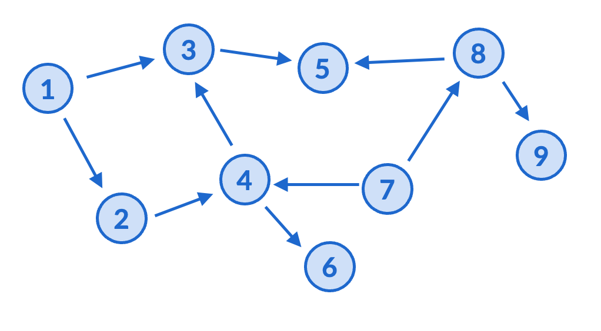
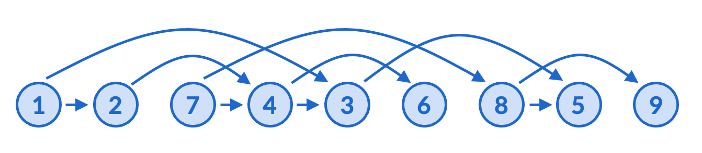
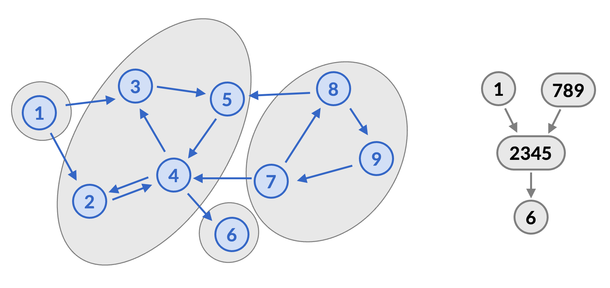

---
title: Directed Graphs
...

# DAGs and Topological sort

In lecture on Monday, we discussed cycles in graphs. Recall that a cycle is a sequence of vertices consecutively joined by edges, with all vertices distinct except the first and last. We say that a graph is *acyclic* if it has no cycles. Directed acyclic graphs are especially important, and we call them DAGs. 

The most important property of a DAG is that they admit a *topological sort*. A topological sort of a DAG is an ordering of the vertices such that every vertex comes before its out-neighbors. In other words, if edges $(a, b)$ mean "$a$ must be done before $b$", then DAGs are exactly the situations that are possible to do.

In the pictures below, I have drawn a graph, as well as the same graph whose vertices are laid out in a topologically sorted order. Check for yourself that they really are the same graph (all the edges are between the same vertices), and that the only difference is layout. Topological sort means that all the edges are pointing to the right.

Depending on who you took 373 with, you may or may already know an algorithm for topological sort. There are many different algorithms that all work. I encourage you to brainstorm how you might try to do this, if not on a computer, at least techniques for pen-and-paper. 

# Strongly connected components

Recall that in an undirected graph, a graph is connected if you can go from any vertex to any other vertex. In math, this is the *definition* of connecteness, and it captures the English intuitive sense quite well.

In a directed graph, the English word "connected" does not really align with the above definition. For example, if you just have two vertices $a$ and $b$, and a directed edge $(a, b)$, it is *not* true that you can go from any vertex to any other vertex, since you cannot go from $b$ to $a$. But if you showed a non-math person on the street this graph, they would likely use the English word "connected" to describe this.

That is why in directed graphs, we say that a graph is *strongly connected* if you can go from any vertex to any other vertex. It's the same definition as "connected" for undirected graphs, just a different phrase to better match our intuition. 

A *strongly connected component* (SCC) in a directed graph is the analogue of a connected component in an undirected graph. It is a maximal set of vertices for which you can travel between any pair. As a reminder, as always, "maximal" means that you can't add any more vertices without violating the property. (It is different from "maximum", which means the most overall, where you can also swap out some vertices that you already have.)

In the below picture (on the left), all of the SCCs are drawn in gray. For example, check for yourself that all the vertices in the $\{2, 3, 4, 5\}$ group are reachable from each other, but for every vertex outside this group, there is either no path to that vertex, or no path from that vertex to this group, so it is a maximal SCC.

In the image on the right, each SCC has been condensed into a single vertex, by merging the vertices and removing duplicate edges. This is called the *condensation graph* of a directed graph. It is important because of the following theorem.

**Theorem.** The condensation graph of any directed graph is acyclic.

*Proof.* Suppose for contradiction there was a cycle connecting (at least) two strongly connected components. Then you can go between any two vertices across these components using the cycle. So the components were not maximal, contradiction.

Since DAGs can be topologically sorted, this means that a common way to process a directed graph is to follow a topological sort of these strongly connected components.

## Looking ahead

In class on Wednesday, we will discuss briefly how each of these mathematical concepts are implemented in algorithms. After that, we'll also apply these concepts to solve problems.