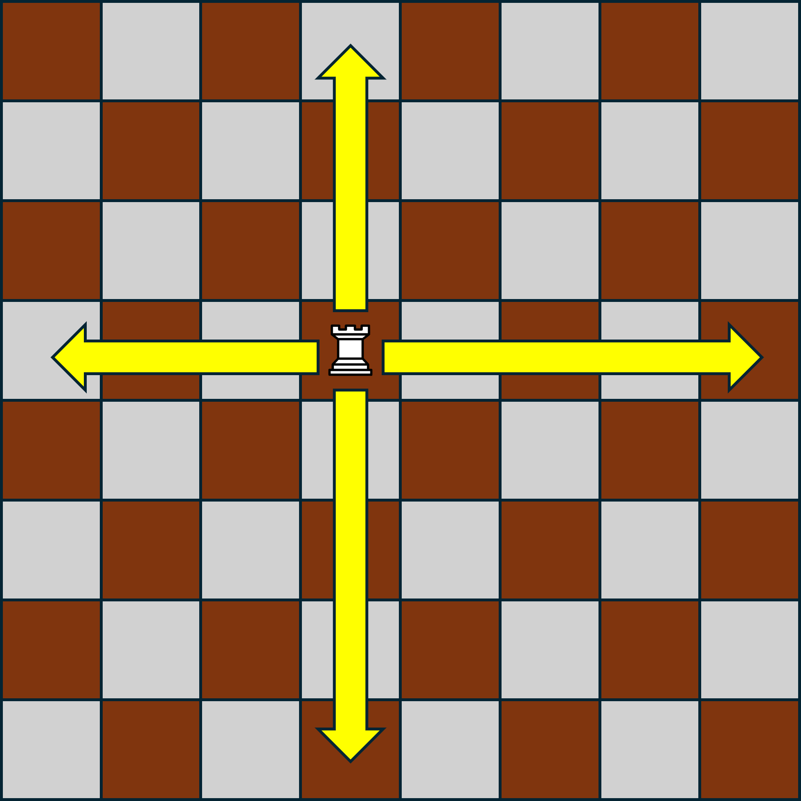

---
title: Introduction to Dynamic Programming
...

You likely saw Dynamic Programming in your CSE 373 class if you took that at UW. However, that topic is not a required one in the CSE 373 curriculum, and so if you transferred equivalent credit in you may not have seen it before. For this reason, we will be covering this topic as if this is your first exposure.

# Intuition Behind Dynamic Programming

Like we saw with divide and conquer, many algorithm design strategies involve one key insight -- that smaller problems are easier to solve than larger ones. 

In divide an conquer algorithms, we leveraged this insight to design algorithms by finding a way to break up one large problem into smaller versions of itself. To achieve efficiency benefits from this, we needed to ensure that the processes of dividing our large problem up and later utilizing the solutions cumulatively took less time that solving the large problem by some alternative means. Or, the way that I prefer to summarize it, divide and conquer algorithms require the solutions to subproblems are *helpful* for solving a large problem.

Dynamic programming works similarly to divide and conquer in that we will decompose our input into one or more smaller subproblems. The main difference we'll see is that across the recursion of our divide and conquer algorithms we do not typically expect to see the same subproblem appear multiple times (e.g. in merge sort we don't really expect to recursively sort the same list multiple times), whereas with dynamic programming, the structure of the problems *will* result in some subproblems reocurring many times. With this property, dyanmic programming algorithms therefore *store* solutions to subproblems in memory. That way when a subproblem is re-encountered, it can use the saved solution rather than recompute it.

So, to summarize, dynamic programming works by:

1. Identifying a way to decompose large problems into smaller subproblems
1. Saving subproblem solutions to avoid resolving them if we see them again.

# DP Example - Rook Paths

To see dynamic programming in action, we will look at an example problem.

Suppose we have a chess board (an 8x8 square grid), and there is one rook on this board. For reference, a rook is a chess piece which is permitted to travel along either a row or a column on the board (i.e. they may not move diagonally). If we label each row and column of the chess board so that each grid can be references with a coordinate pair (e.g. cell $(0,0)$ might be the upper-left corner, and $(7,7)$ is the lower-right) then one move of the rook is permitted to change either its row or column, but not both. The image below demostrates where a rook is permitted to move in a single turn of chess.

The problem we wish to solv is the following. Provided the rook begins in the uppler-left corner of the board (we'll call this location $(0,0)$), how many *direct* paths are there to the location $(i,j)$?

We say a path is *direct* provided it only goes in the positive direction in both rows and columns, which is to say, it never "backtracks" in any direction.

For example, one direct path might be that the rook travels from $(0,0)$ to $(i,0)$ and then from $(i,0)$ to $(i,j)$. Another alternative might be $(0,0) \rightarrow (0,j) \rightarrow (i,j)$. A third alternative might be $(0,0) \rightarrow (0,1) \rightarrow (i,1) \rightarrow (i,j)$.

