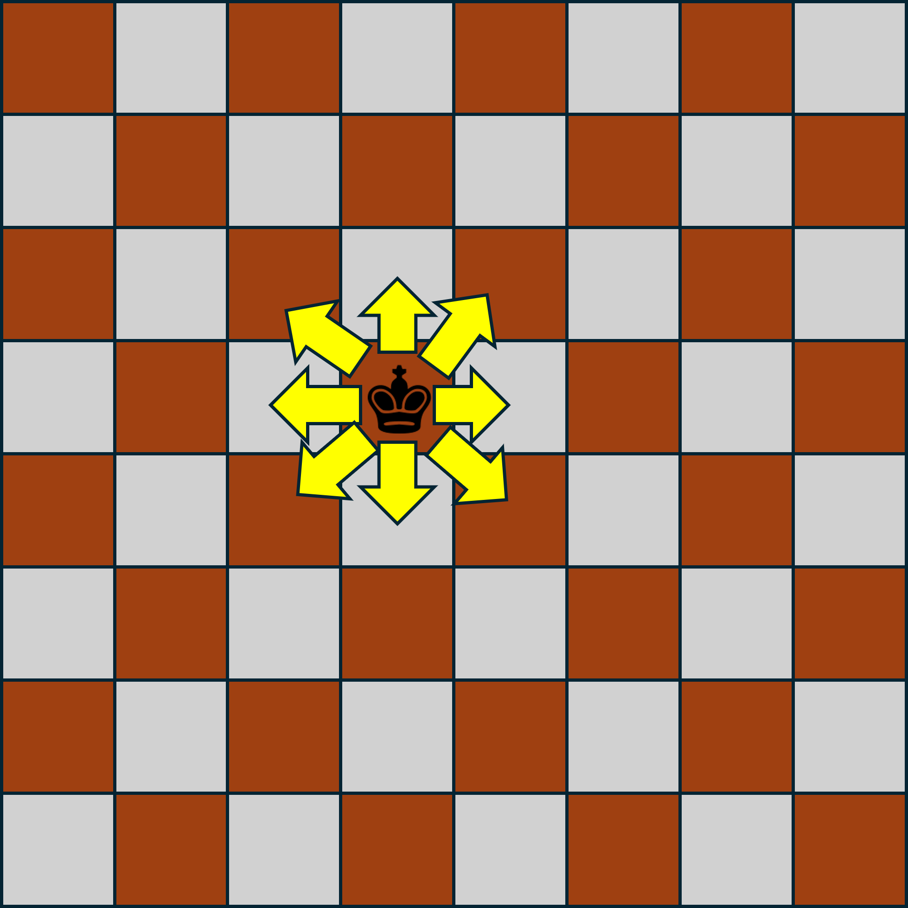
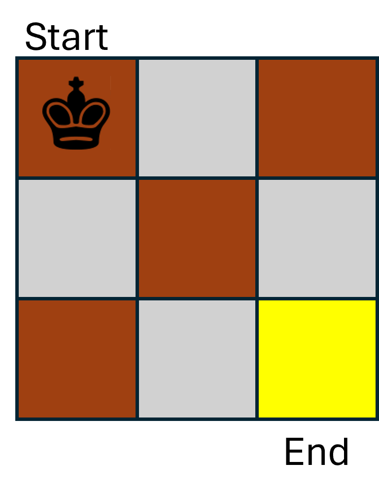
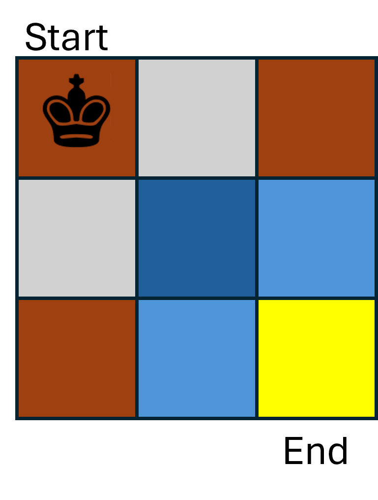
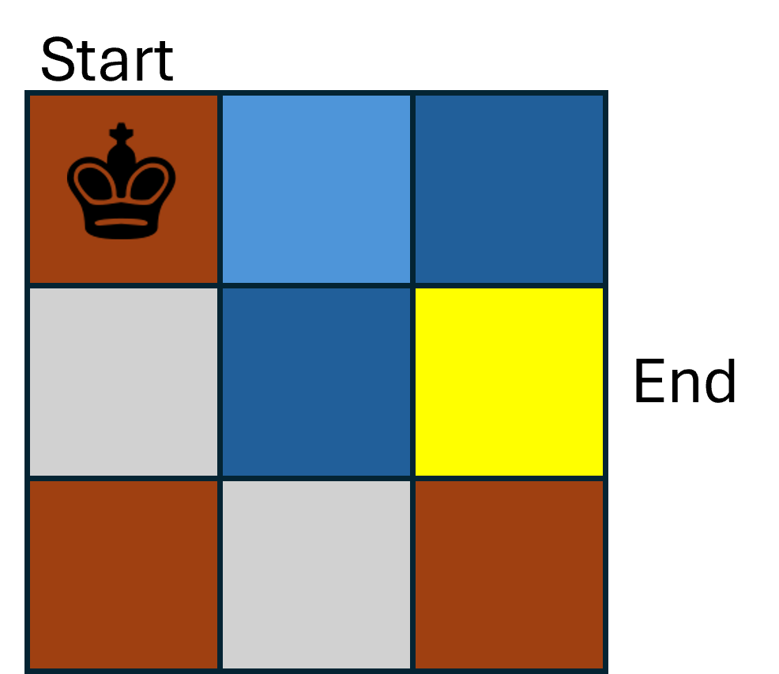

---
title: Introduction to Dynamic Programming
...

You likely saw Dynamic Programming in your CSE 373 class if you took that at UW. However, that topic is not a required one in the CSE 373 curriculum, and so if you transferred equivalent credit in you may not have seen it before. For this reason, we will be covering this topic as if this is your first exposure.

# Intuition Behind Dynamic Programming

Like we saw with divide and conquer, many algorithm design strategies involve one key insight -- that smaller problems are easier to solve than larger ones. 

In divide an conquer algorithms, we leveraged this insight to design algorithms by finding a way to break up one large problem into smaller versions of itself. To achieve efficiency benefits from this, we needed to ensure that the processes of dividing our large problem up and later utilizing the solutions cumulatively took less time that solving the large problem by some alternative means. Or, the way that I prefer to summarize it, divide and conquer algorithms require the solutions to subproblems are *helpful* for solving a large problem.

Dynamic programming works similarly to divide and conquer in that we will decompose our input into one or more smaller subproblems. The main difference we'll see is that across the recursion of our divide and conquer algorithms we do not typically expect to see the same subproblem appear multiple times (e.g. in merge sort we don't really expect to recursively sort the same list multiple times), whereas with dynamic programming, the structure of the problems *will* result in some subproblems reocurring many times. With this property, dyanmic programming algorithms therefore *store* solutions to subproblems in memory. That way when a subproblem is re-encountered, it can use the saved solution rather than recompute it.

So, to summarize, dynamic programming works by:

1. Identifying a way to decompose large problems into smaller subproblems
1. Saving subproblem solutions to avoid resolving them if we see them again.

# DP Example - King Paths

To see dynamic programming in action, we will look at an example problem.

Suppose we have a chess board (an 8x8 square grid), and there is one king on this board. For reference, a king is a chess piece which is permitted to travel one step horizontally or diagonally at a time. If we label each row and column of the chess board so that each grid can be references with a coordinate pair (e.g. cell $(0,0)$ might be the upper-left corner, and $(7,7)$ is the lower-right) then one move of the king is permitted to change it row by one, its column bye on, or both. The image below demostrates where a king is permitted to move in a single turn of chess.

The problem we wish to solve is the following. Provided the king begins in the uppler-left corner of the board (we'll call this location $(0,0)$), how many *direct* paths (sequences of moves) are there to the location $(i,j)$?

We say a sequence of moves is *direct* provided it only goes in the positive direction in both rows and columns, which is to say, it never "backtracks" in any direction. We added in this direct path requirement to ensure that the number is finite, as without it a king could travel between $(0,0)$ and $(0,0)$ an arbitrary number of times before proceding to $(i,j)$.

For example, if we're trying to move from $(0,0)$ to $(1,1)$ one direct sequences of moves might be that the king travels from $(0,0)$ to $(1,0)$ and then from $(1,0)$ to $(1,1)$. Another alternative might be $(0,0) \rightarrow (0,1) \rightarrow (1,1)$. A third alternative might be $(0,0) \rightarrow (1,1)$. The path $(0,0) \rightarrow (0,1) \rightarrow (0,2) \rightarrow (1,1)$ is not direct because the king traveled "backwards" by one column in its path. Therefore the answer for this problem is 3.

## Decomposing into subproblems

As we mentioned, to design our dynamic programming algorithm we will break our input down into subproblems. To do this, my go-to strategy is to ask "while building a solution, what are the options for what might happen *last*?". In this case, we can identify subproblems by considering all cells the rook is permitted to be in immediately prior to moving to it's final destination.

To simplify this a bit, let's look at a smaller chess board that's only 3x3, and we want to go from $(0,0)$ to $(2,2)$ (as shown below).

To answer this question, we can first observe that there are 3 different cells that the king could occupy prior to its final move, those being $(1,2),(2,1),(1,1)$. Therefore, any of path that ends at any of those three locations could be extended by one move to produce a path to $(2,2)$. This means our answer will match the number of paths from $(0,0)$ to $(1,2)$ plus the number of paths from $(0,0)$ to $(2,1)$ plus the number of paths from $(0,0)$ to $(1,1)$. Each of these is just a smaller version of the same path-counting problem, so we can solve those recursively!

To represent this symbolically, we have $pathcount(2,2)=pathcount(1,2)+pathcount(2,1)+pathcount(1,1)$.

## Overlapping Subproblems

To see where dynamic programming *really* makes a difference, let's see what happens as we're recursively solving $pathcount(1,2)$. We're going to repeat the same process of above and look at all of the places the king might be before it makes its final move to cell $(1,2)$. Again, we see that there are three options: its left neighbor $(1,1)$, its upper neighbor $(0,2)$, and its upper-left neighbor $(0,1)$. Therefore the for $pathcount(1,2)$ is equal to $pathcount(1,1)+pathcount(0,2)+pathcount(0,1)$.

Importantly, though, one of these recursive calls was shared betweent $pathcount(2,2)$ and $pathcount(1,2)$! Specifically, both needed to know $pathcount(1,1)$. This is where dynamic programming differs from divide and conquer, we expect to see these subproblems repeat!

To avoid re-solving $pathcount(1,1)$ (or other subproblems) from scratch, a dynamic programming algorithm will store solutions before returning them, and check for stored solutions before computing them.

## Base Cases

Because dynamic programming algorithms are recursive in nature, we are going to need one or more base cases as well. For the king's paths example, we'll make the base cases $pathcount(0,1)=1$, $pathcount(1,0)=1$, and $pathcount(1,1)=3$.

## Bringing it all together

Now let's look at all of the insights we've gathered thus far, and design our final dynamic programming algorithm to solve $pathcount(i,j)$.

Suppose we have a global 2d array called $stored$ such that we will store the answer to each subproblem $pathcount(r,c)$ in cell $stored[r][c]$. We'll initialize each value of $stored[r][c]$ to be -1 to indicate that the value has not been computed yet. 

The first thing our algorithm will do is check to see if our problem has already been computed by seeing if a solution $pathcount(i,j)$ is stored in memory by checking if $stored[i][j]\geq 0$. If so, then just return that.

Next we'll check if this is a base case, and if it is then we record the solution to $pathcount(i,j)$ in $stored[i][j]$, then return that solution.

Otherwise we're in our recursive case. From our discussion, we see that along any path to cell $(i,j)$ we must be in one of $(i-1,j)$, $(i,j-1)$, or $(i-1,j-1)$ before making the last move. Therefore to solve $pathcount(i,j)$ we want to solve the subproblems $pathcount(i-1,j)$, $pathcount(i,j-1)$, and $pathcount(i-1,j-1)$. Once we have those answers, we add them, store the result in $stored[i][j]$, and then return the answer.

# DP algorithm template

To summarize, here is a general template for the behavior of a dynamic programming algorithm:

1. For a given input, check whether we have already solved that input. If so, just return the previously-recorded solution
1. If we haven't solved it already, check if this is a base case. If so then solve it non-recursively, record the solution to memory, and return the answer
1. Finally, if we're in the recursive case then identify the subproblems, recursively solve each, combine them to a final answer, store that final answer in memory, and finally return that answer.