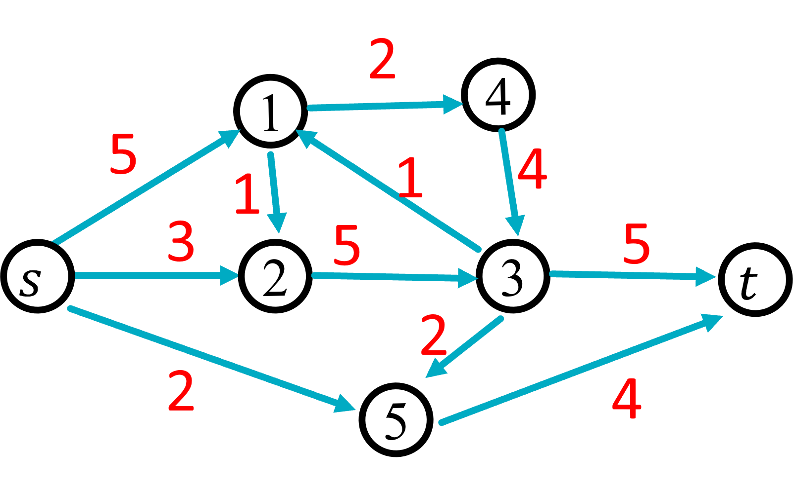
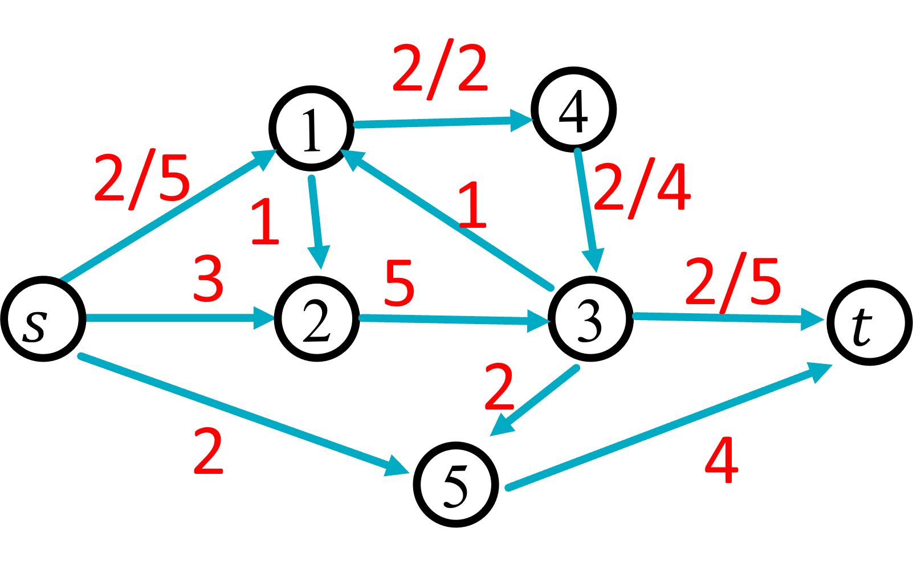
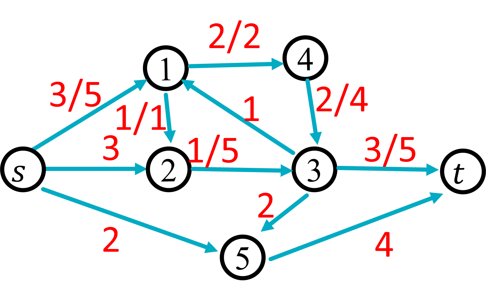
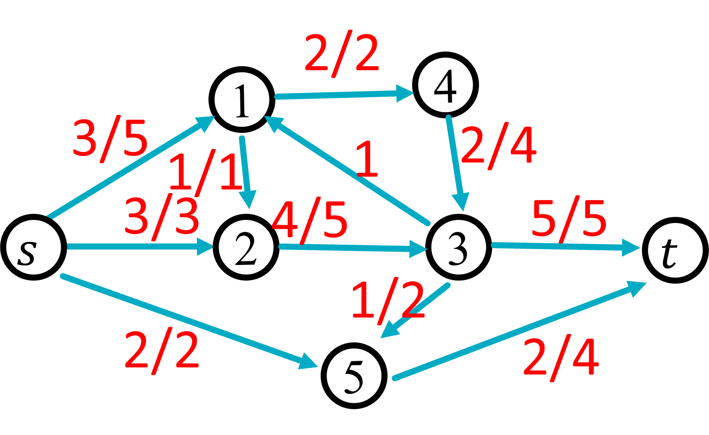

---
title: Flow
...

# Reductions

So far we've discussed 3 different algorithm design strategies: divide and conquer, dynamic programming, and greedy. In this unit we will introduce our final algorithm design strategy of the quarter called *reductions*. 

All three algorithm design strategies we have covered thus far work on the same idea, that smaller problems are easier to solve than bigger ones. Therefore they take the approach of converting large inputs to the problem into smaller inputs to the same problem. Reductions take a different approach, working off of the idea that the easiest problems to solve are the ones you already have an algorithm for. With reductions, you design an algorithm for your problem by converting it to a different problem that you already have an algorithm for. In other words, you transform the new problem to an already-solved one so you can just use a preexisting algorithm to solve it.

You've actually already seen examples of this. Most notably, the problem of finding a "money pump" in currency exchanges could be converted into the problem of finding a negative-cost cycle in a graph. This conversion of the money pump problem into a cycle-finding problem then allowed us to just use Bellman-Ford to solve the problem.

Because reductions require you to convert a new problem into one with a pre-existing solution, the first thing you need in order to be proficient at solving problems by reduction is a solid foundation of problems you're familiar with. Towards this end, in this unit we will begin by introducing a problem which is heavily used in a broad diversity of reductions. This problem is called Max Flow.

# Motivation

To put it broadly, the Max Flow problem relates to finding the optimal way of moving objects through a network. For example, imagine that we have a train network and we want to ship our product using this network. As  historical aside, the original motivation for this problem was to study how military tanks might be transported through the rail networks in the USSR, so we'll let our product be tanks. When shipping these tanks, we have two main challenges. First, each track has a maximum number of tanks it can handle per day (because of weight limits on the track or the capabilities of the trains that can use it). Second, tanks can be moved from one train to another, but only at train stations (since trains should not stop mid-track). Under these constraints, we want to find the best way to move our tanks through our rail network as quickly as possible. That is, find how to assign tanks to train tracks in the way that maximizes the flow rate of tanks through the network.

## Problem Statement

Now lets take this motivating example, and express it in a way suitable for writing an algorithm to solve it.

Fundamentally, this problem is a graph problem. Our input will be a special kind of weighted and directed graph that we call a *flow network*. The edges in a flow network are like the train tracks, they carry "flow" (e.g. tanks), and their weights represent the maximum amount of flow they can carry, which we call *capacity*. The nodes are like train stations, they allow flow to be redistributed across other edges. To make things simpler at first (we'll discuss how to modify this later), we'll assume that there is a special node that we call the *source* where all flow must originate from (e.g. the tank factory). Additionally, we'll have a special node called the *sink* which is the final destination of all flow (e.g. the tank store).

To summarize, a *flow network* is a weighted directed graph with the following properties:

- One node, called $s$, is designated as the *source node*
- A different node, called $t$, is designated as the *sink node*
- Every edge has a weight that we call its *capacity*

To solve our flow problem, we want to assign flow to edges (e.g. assign tanks to railroads) to maximize the number of tanks that can move from the source node to the sink node. We refer to *flow graph* as a flow network with flow assigned to edges satisfying all of the following constraints:

- *Capacity Constraint*: the amount of flow assigned to each edge is less than or equal to its capacity (e.g. no railroad is overloaded)
- *Flow Conservation Constraint*: With the exception of the source and sink nodes, the total flow entering each node must exactly match the flow exiting (e.g. no train station should be producing or accumulating tanks, they only pass through)

For a flow graph, we can then measure the total amount of flow going through it by looking at the total flow exiting from the source node (or equivalently, entering into the sink node)

Therefore, we can state this Max Flow problem as: Given a flow network, find the flow graph which maximizes the total flow exiting from its source node.

Next we'll look at some examples and illustrations of all of this new vocab above (I know, it's a lot!)

## Drawing a flow network

Below we have an example of a flow network. 

This flow network has 7 nodes. The source node is labelled $s$, the sink is labelled $t$, and the remaining nodes have labels 1 through 5. The edges are directed and each has a capacity as follows:

- edge $(s,1)$ has capacity 5
- edge $(s,2)$ has capacity 3
- edge $(s,5)$ has capacity 2
- edge $(1,4)$ has capacity 2
- edge $(1,2)$ has capacity 1
- edge $(2,3)$ has capacity 5
- edge $(1,4)$ has capacity 5
- edge $(3,1)$ has capacity 1
- edge $(3,5)$ has capacity 2
- edge $(3,t)$ has capacity 5
- edge $(4,3)$ has capacity 4
- edge $(5,t)$ has capacity 4

Any way of assigning flow to edges to satisfy the two constraints above is considered a valid flow graph. For example, this is a valid flow graph:

In this flow graph, we denote the amount of flow assigned to an edge as $f/c$ where $f$ is the flow assigned and $c$ is the capacity of that edge. By convention, if we assign 0 flow to an edge then we only write the capacity for that edge. In the illustration above, we have assigned 2 units of flow to each of the edges $(s,1),(1,4),(4,3),(3,t)$. All other edges have 0 flow. To verify that this is a valid flow network we need to verify that it satisfies the constraints above:

- **Capacity Constraint**: Satisfied because no edge's flow has exceeded its capacity
- **Flow Conservation Constraint**: satisfied because the total amount of flow entering each node exactly matches the flow exiting ($s$ and $t$ are exempt from this requirement).

Since this a valid flow graph, we can next find the total flow going through it. To do this, we will add up all of the flow exiting from $s$. In this case, only the edge $(s,1)$ has flow, and the flow assigned to that edge is 2, so the total flow through the graph is 2.

The following is a graph with three units of flow. We were able to obtain more flow through this graph by adding 1 unit of flow along the path $s, 1, 2, 3, t$.

We typically think of flow being added along a path from $s$ to $t$, as this ensures we maintain the flow conservation contraint (every unit of flow entering a node gets immediately passed along to the next node in the path). Note that this graph still satisfies the flow conservation constraint. To verify this we need to ensure the total flow entering each node exactly matches the total flow exiting. For example, there are 3 total units of flow entering node $1$ (all from edge $(s,1)$), and there are 3 total units of flow exiting node $1$ (1 on edge $(1, 2)$ and 2 on edge $(1,4)$).

Finally, the following reprents a graph with 8 units of flow, which is the maximum for this flow network. We therefore say that this is the solution for the max flow problem. We will discuss how to find this graph, and how to verify that its flow is maximum in class.

