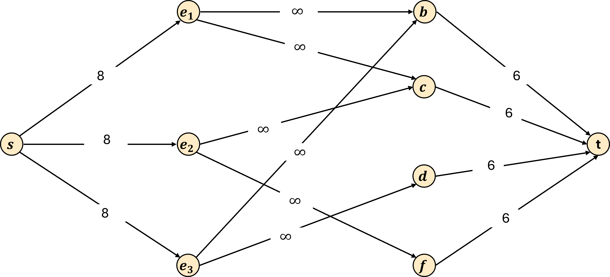
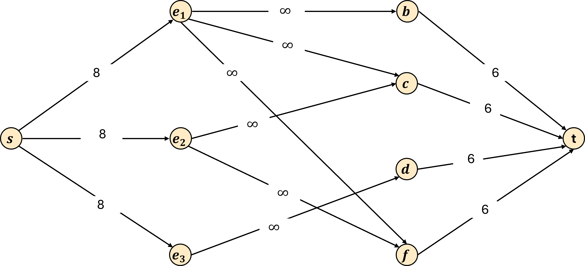
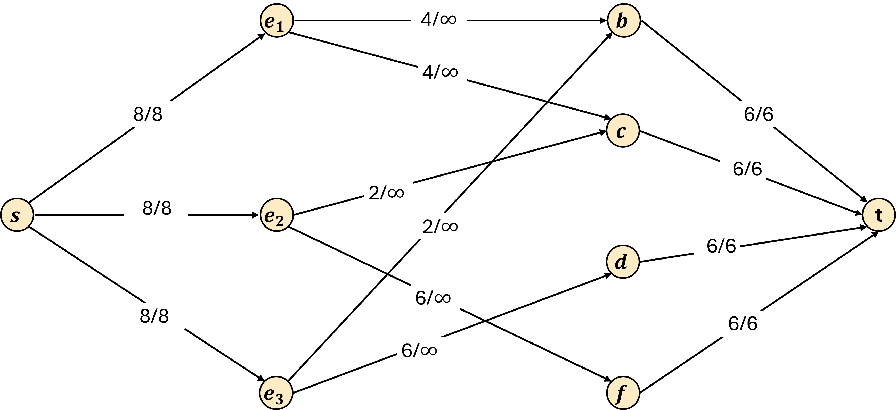

---
title: Flow and Reductions
...

Last class we introduced the Max Flow/Min Cut problem, and presented the Ford-Fulkerson algorithm to solve it. In this reading we'll show an example of how we can use this Max Flow/Min Cut problem to solve a different and seemingingly unrelated problem.

# Tofu Factory

Supposing Nathan's career as a professor doesn't work out, nor does his career as a tomato farmer, nor does his career as a lumberjack, Nathan would next open up a tofu factory. In this reading we will write an algorithm to help Nathan to staff his tofu factory.

The process of making tofu requires 4 main steps, and the factory will have a station for each:

1. **Blend**: Take soaked soy beans, wash them, add water, then blend until smooth.
2. **Cook**: Simmer the mixture, stirring constantly.
3. **Drain**: Drain the mixture to separate out the soy bean solids using a cloth.
4. **Finish**: Add nigari (a coagulant derived from seawater) to the liquid left behind. Add the resulting curds to a mold.

Each of these stations requires a specific number of hours of work per day. For example, it might be that each day the factory needs workers to **blend** for a total of 2 hours cumultive. Our goal is to assign workers to stations so that we can complete all the required hours for all four stations. 

There are some constraints we have, however, that complicate this:
1. Each worker must be trained in each station before they can perform it
2. No worker can be assigned to any more than 8 hours of work per day

So our task is to write an algorithm to determine whether it's possible to fully staff all of our stations in the tofu factory under these constraints.

## Input

Next let's more formally define what our input is going to be to this algorithm. As input we will have a set of $n$ employees that we call $E$. Employees will be labelled $e_1$ through $e_n$. Each employee $e_i$ will also have a four boolean values that we call $b_i, c_i, d_i, f_i$ where each is true or false to indicate whether that employee has been train on the blend, cook, drain, and finish stations respectively. Additionally, we will have four integers $t_b, t_c, t_d, t_f$ representing the total time we need employees to work at the blend, cook, drain, and finish stations respectively.

We'll expand this later, but for not we'll keep the output of the algorithm simple. We'll just require the algorithm to return true or false to indicate whether or not it is possible to complete staff all stations in the factory.

## True Example

Let's first look at an example where we would want the algorithm to return true, i.e. the factory CAN be staffed. 

Suppose $n=3$, and $E$ is as follows:

- $e_1$: $b_1=\texttt{true}$, $c_1=\texttt{true}$, $d_1=\texttt{false}$, $f_1=\texttt{false}$
- $e_2$: $b_2=\texttt{false}$, $c_2=\texttt{true}$, $d_2=\texttt{false}$, $f_2=\texttt{true}$
- $e_3$: $b_3=\texttt{true}$, $c_3=\texttt{false}$, $d_3=\texttt{true}$, $f_3=\texttt{false}$

And then our stations' time needs are as follows:

- $t_b = 6$
- $t_c = 6$
- $t_d = 6$
- $t_f = 6$

We could then fully staff all stations by assigning employees in the following way:

- $e_1$ will spend 4 hours blending and 4 hours cooking
- $e_2$ will spend 2 hours cooking and 6 hours finishing
- $e_3$ will spend 2 hours blending and 6 hours draining

This satisfies all our requirements! Each station has 6 hours of employee time assigned, employees are only assigned to stations they have been trained on, and no employee is assigned to more than 8 hours of work.

## False Example

Next let's see an example where we would want the algorithm to return false, i.e. the factory CANNOT be staffed. 

We'll again have $n=3$, and will make only two changes $E$. We'll make it so $e_1$ is now trained on the finishing station, and $e_3$ is only trained on draining. So in total:

- $e_1$: $b_1=\texttt{true}$, $c_1=\texttt{true}$, $d_1=\texttt{false}$, $f_1=\texttt{true}$
- $e_2$: $b_2=\texttt{false}$, $c_2=\texttt{true}$, $d_2=\texttt{false}$, $f_2=\texttt{true}$
- $e_3$: $b_3=\texttt{false}$, $c_3=\texttt{false}$, $d_3=\texttt{true}$, $f_3=\texttt{false}$

But our stations' time needs will remain the same:

- $t_b = 6$
- $t_c = 6$
- $t_d = 6$
- $t_f = 6$

It turns out that there is no way to satisfy all of the requirements here. Because this is a small example, we can pretty quickly see why. Because $e_3$ is only one trained on the draining station, we need to assign $e_3$ to all 6 hours there. However, this is the only station that $e_3$ is trained on, so we have to cover the other three stations with the remaining two employees. However, these two employees can only work a total of 16 hours, and the three stations require 18 hours of work. 

This may not be as straightforward, though, if we have a lot more employees and a lot more needs per station. We'll find, though, that max flow can be super helpful!

# The Tofu Factory Problem as Max Flow

To create an algorithm for our tofu factory problem, we will perform what we call a *reduction*. A reduction the name we give to a special pair algorithms. The first is a procedure which transforms inputs of one problem into inputs of a different problem. The second is a procedure for interpretting the solutions for that other problem into solutions to the first. In all, this reduction combined with an algorithm for solving the other problem produces an algorithm for solving our original problem! This algorithm would solve our original problem in the following way:

1. Use the first algorithm in the reduction to convert our input of our original problem into an input to our other problem
1. Use some algorithm to solve that other problem for our chosen input
1. Use the second algorithm in the reduction to convert that solution into the solution to our original problem.

For our tofu factory example, we will reduce our tofu factory problem to max flow, meaning we will solve it by:

1. Using an algorithm that we design to convert our tofu factory input into a flow network
1. Running Ford-Fulkerson on that flow network to get the max flow value
1. Using the max flow value to determine whether we could fully staff our tofu factory

## Constructing a Flow Network

Now that we know our strategy, let's just directly to a way to construct a flow network using the tofu factory input.

Overall, our flow network will have $n+6$ nodes, defined as follows:

- One node per each of the $n$ employees
- One node per each of the $4$ stations
- A source node $s$
- A sink node $t$

The idea will be that we assign employees to stations by adding flow from the source to an employee, from that employee to a station, then from a station to the sink. So we need to add edges with weights to allow us to do this under the problem's constraints. We'll define our edges as follows:

- We have an edge from $s$ to each employee $e_i$ with capacity $8$.
- We have an edge from each $e_i$ to each station that employee is trained for (e.g. there is an edge from $e_i$ to $b$ if $b_i=\texttt{true}). The capacity on this will be $\infty$.
- We have an edge from each station to the sink, where the capacity is the number of hours we need to staff that station (i.e. the edge from $b$ to $t$ would have capacity $t_b$).

Applying this construction to the inputs provided above results in the following graphs:

The idea here is that each unit of flow represents on hour of work that an employee is assigned to a station. By having the capacity of every source-to-employee edge set to 8, the capacity constraint of max flow problems ensures that no employee is assigned to more than 8 hours. Because the tofu factory problem does not limit the number of hours we assign per station, we set the capacities of the employee-to-station edges to $\infty$ (if you or your programming language do not like having a non-number as the capacity, you can instead set it to a value guaranteed to not be a "bottleneck" in the flow, in this case 8 would work). We then assign the capacities of each station-to-sink edge to be the staffing requirement for that station. We can then tell if the factory was fully staffed by checking if all station-to-sink edges are saturated, or equivalently, that the max flow through the network matches the sum of $t_b+t_c+t_d+t_f$.

So, with that in mind, let's look at the result of running of Ford-Fulkerson on each graph.

Observe for this graph the flow value is equal to $24$. Because our capacities ensure that each employee is assigned to at most 8 hours of work, each employee is only assigned to stations on which they have been trained, and no station has more than the required number of hours assigned to it, the only way to to achieve $24$ units of flow is if we fully staffed all stations. Therefore our algorithm will correctly return true!

As an additional observation, if we wanted to modify our algorithm to return an assignment of employees to stations, the flow graph has all the information necessary to do so! Notice that the flow assigned to each employee-to-station edge exactly matches the solution we provided above. Therefore our reduction could instead return the flow amounts for each employee-station pair.

In this graph the flow value is equal to $22$. Since we know that there are $24$ hours of work needed to full staff all stations, it must be that some station is not fully staffed. We can then conclude that it is impossible to fully staff all stations because any valid way of assigning employees to stations would represent a valid flow. Therefore our algorithm correctly returns false. 

# Final Algorithm Summary

With all of this in mind, we can now summarize our algorithm for solving the tofu factory problem:

1. First we build a flow network using the tofu factory problem input as follows:
    - Nodes ($n+6 total$):
        - One node per each of the $n$ employees
        - One node per each of the $4$ stations
        - A source node $s$
        - A sink node $t$
    - Edges:
        - From $s$ to each employee $e_i$ with capacity $8$.
        - From each $e_i$ to each station that employee is trained for (e.g. there is an edge from $e_i$ to $b$ if $b_i=\texttt{true}) with capacity $\infty$.
        - From each station to the sink with capacity equal to the number of hours we need to staff that station (i.e. the edge from $b$ to $t$ would have capacity $t_b$).
1. Next we run Ford-Fulkerson on this flow network to find the maximum flow value through this graph. Call that value $v$.
1. Return true if $v = t_b+t_c+t_d+t_f$, and false otherwise

We say that our reduction is the pair of algorithms described by step 1 and step 3 above (converting input of tofu factory to an input for Ford-Fulkerson, then converting the Ford-Fulkerson result to the tofu factory solution).

