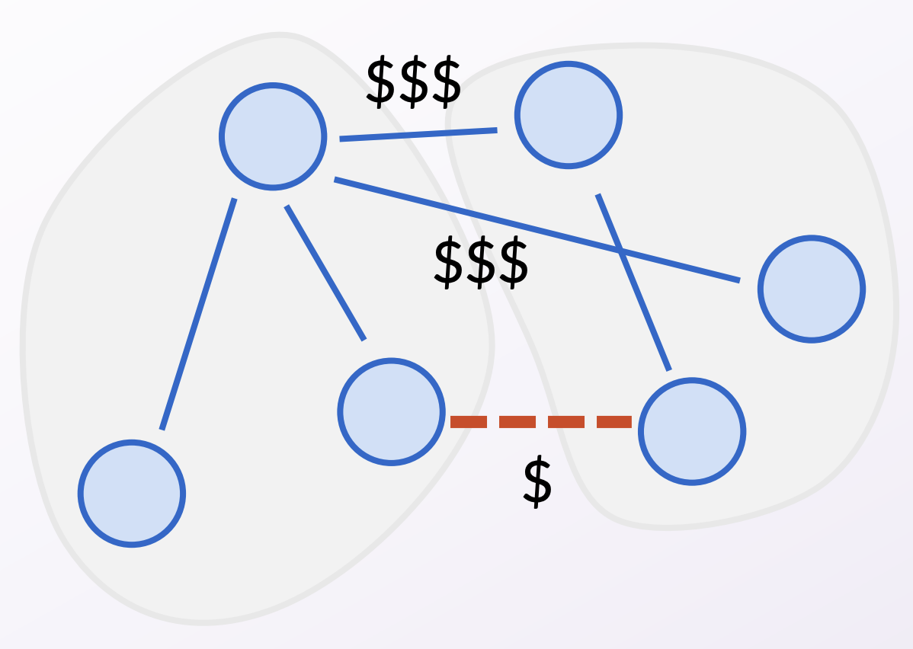
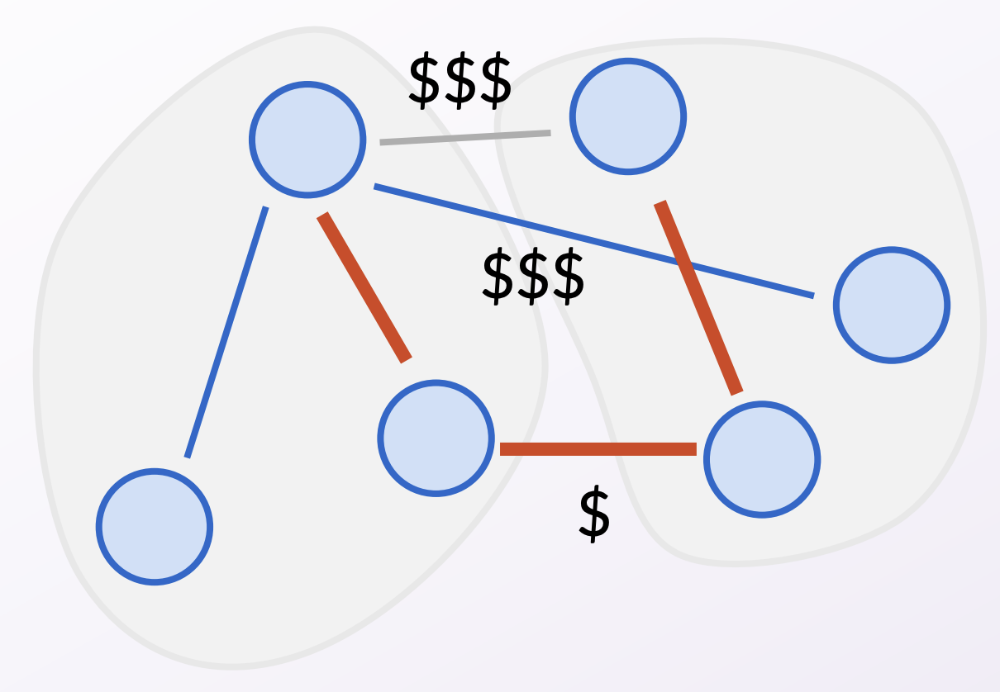

---
title: Intro to greedy algorithms
...

# From DP to greedy

Greedy algorithms solve *optimization problems*, similar to dynamic programming. In an optimization problem, there are many *feasible solutions*, some of which are better than others. For example, 

* When cutting a log of length $n$, a feasible solution was any list of lengths that sum to $n$. Then, we found the feasible solution that gave the most profit.
* When deciding oven allocation with $M$ minutes available, a feasible solution was any collection of items whose total time to bake was at most $M$. Then, we found the feasible solution that gave the most profit.

Dynamic programming is a clever technique that lets you search through all feasible solutions and find the best one, while not using too much time by storing the results of subproblems. In contrast, **greedy algorithms will not search through all feasible solutions**. Instead, a greedy algorithm will just make the best local choice at each step. 

Greedy algorithms are easy to write and easy to brainstorm. Because we don't search through all feasible solutions, many times, a greedy algorithm *will not* find the optimal solution. But for some particular problems, there is actually a greedy way to always find the optimal solution!

# Dijsktra's, Prim's, and Kruskal's algorithms

These three graph algorithms that we covered a few weeks ago were actually greedy algorithms! Take Kruskal's algorithm for minimum spanning trees, for instance. Given a connected graph with vertices $V$ and edges $E$, recall that Kruskal's algorithm is the following:

```
1. Create a new graph on vertices V with no edges.
2. Repeat n-1 times:
3.     Pick the cheapest edge in E that doesn't make a cycle with our previous picks.
```

This is a greedy algorithm because:

* It tries to solve an optimization problem, to find the *cheapest* spanning tree.
* It doesn't search through all feasible solutions (spanning trees), just constructs one. 
* At each step, it makes a "best" choice, for some definition of "best". In this case, "best" means cheapest while avoiding cycles.

Similarly, recall that Prim's algorithm is:

```
1. Start with a single vertex.
2. Repeat n-1 times:
3.     Pick the cheapest edge in E that connects the existing tree to a new vertex.
```

This is also a greedy algorithm because:

* It also tries to solve an optimization problem, to find the cheapest spanning tree.
* It also doesn't search through all feasible solutions (spanning trees), just constructs one. 
* At each step, it also makes a "best" choice, for some definition of "best". In this case, "best" means cheapest while connecting a new vertex.

In general, there are many possible options for what is "best" choice at each step. For minimum spanning tree, both of the above solutions work. However, here is one greedy choice (for example) that would not always find the optimal spanning tree:

```
1. Create a new graph on vertices V with no edges.
2. Repeat n-1 times:
3.     Pick the most expensive edge in E that doesn't make a cycle with our previous picks.
```

This does work sometimes&mdash;if the original graph was already a tree, there is only one feasible solution (the tree itself), and thus picking the most expensive edge is the same thing as the cheapest edge. But clearly, on most graphs, this doesn't do the right thing.

Notably, you get to choose what "best" means. It'll be up to you to brainstorm several possibly greedy choices and determine which ones work or not!

# Exchange arguments

The hardest part about writing a greedy algorithm is explaining why it always finds the optimum solution, despite not searching through all feasible solutions. Our standard tool for this will be called an *exchange argument*. 

Recall how we proved Prim's and Kruskal's algorithms correct. We used the "cut property": that if an edge is the
minimum cost edge across some cut, then it must be in every MST. The following pictures are a brief reminder of how we proved the cut property. Refer to slides 21-28 of Lecture 3.3 (a.k.a. Lecture 11) for a deeper review!





This kind of argument where we "exchange" a piece of a better solution with a piece of our solution to arrive at a contradiction will be our common tool to prove every greedy algorithm correct! We'll see more examples of this in class.

