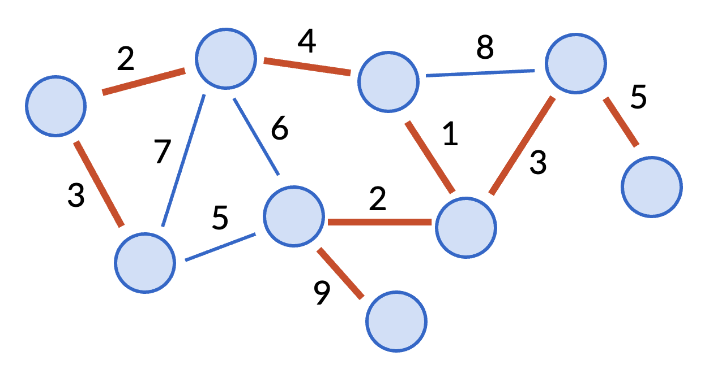

---
title: Minimum spanning trees
...

# A bit more graph theory review

## Trees

In common usage across computer science, a "tree" is what mathematicians might more accurately call a *rooted tree*. It might look something like:

```
         (0)
          |
   ---------------
   |      |      |
  (1)    (2)    (3)
  / \          / | \
(4) (5)      (6)(7)(8)
```
In such a drawing, every vertex (except the root) has unique *parent* above it, and possibly some *children* below it. We use this phrasing to describe the file system on your computer, or the layout of an HTML document. 

In more mathematical contexts like an algorithms class, we use the phrase *rooted tree* for the above kind of structure, and use the word *tree* to just mean **any graph that is connected and has no cycles**. 

```
(0)   (1)
 |     |
(2)---(3)---(4)---(5)
       |     |
      (6)   (7)
      / \
    (8) (9)
```

After forgetting which vertex is the root, a rooted tree also certainly becomes a normal tree. Conversely, you can make any normal tree into a rooted tree by picking any of its vertices to be the root. (Imagine the tree is floppy and you physically pick it up by a vertex, with the other vertices dangling down.) In other words, from a graph theory perspective, a rooted tree is just a particular way to draw a tree. 

**Theorem.** The following are all equivalent definitions for a tree:

1. A graph that is connected and has no cycles.
1. A graph that is connected and has exactly one more vertex than edge.
1. A graph that is connected and the removal of any edge would disconnect the graph.
1. A graph where every pair of vertices is connected by a unique path.

I won't write down the proofs of these equivaences in this class (that would be more suited for a class in graph theory or combinatorics), but you should check for yourself that the two graphs in the pictures above satisfy all four of these defintions, and think for yourself why they are equivalent. 

## Forests

When you put multiple trees together in a single graph, you get a *forest*. This is a pretty simple concept. A forest made up of $\ge 2$ trees is thus not a connected graph.

```
   (a)       (e)---(f)
  /   \         \
(b)   (c)       (g)
       |
      (d)              (i)---(j)
```

## Weighted graphs

Often times, it is useful to put numbers on the edges of a graph. For example, the connectivity of a road network can be described with vertices as destinations and edges as the roads the connect them. But to answer many useful questions about such a network, such as "what's the shortest way to get from the library to the city hall?", we need a little more information&mdash;the length of every road on the network.

More generally, a *weighted graph* is a still a graph (directed or undirected) with vertices and edges, but with an additional *weight* function (or *length*, *distance*, *cost*, etc.) that tells you the weight of every edge in the graph.

# Minimum spanning trees

The core of Friday's class will discuss a concept called *minimum spanning trees* (MSTs). This is an important concept in graph theory, and computer scientists have developed many algorithms to find MSTs.

Here's the main idea: Imagine you have a network of some kind represented as an undirected graph with weights, where the weights represent costs of maintenance or construction. For example, a road network, or a computer server farm with many machines. Due to budget cuts, you can no longer afford to maintain all the direct links between nodes, but want to make sure that everything remains connected. Which edges can you discard and which do you keep to obtain the lowest-cost connected network?

More formally, the input is a connected graph with vertices $V$, edges $E$, and positive costs $c(e)$ for every edge $e$. The goal is to output a new set of edges $E'$ with minimal total cost such that the graph formed with vertices $V$ and edges $E'$ is still connected. Such a graph will always be a tree&mdash;if it's not, you could always find a cycle and delete any edge in that cycle to reduce the cost and maintain connectivity. That is why this problem is called the *minimum spanning tree* problem.

An example of a minimum spanning tree is given in the picture below (in thick red lines).



## Looking ahead

In class, we will discuss two algorithms to solve the MST problem: Prim's algorithm and Kruskal's algorithm. They are our first examples of *greedy* algorithms for this class: algorithms that try to do the best thing overall by simply picking the best thing at every step. We'll talk about greedy algorithms more generally in a few weeks time, but now we're just giving you a small taste!
