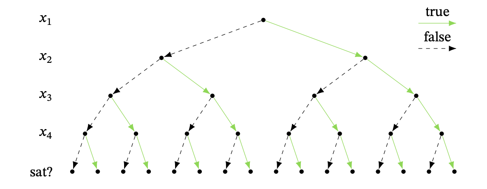
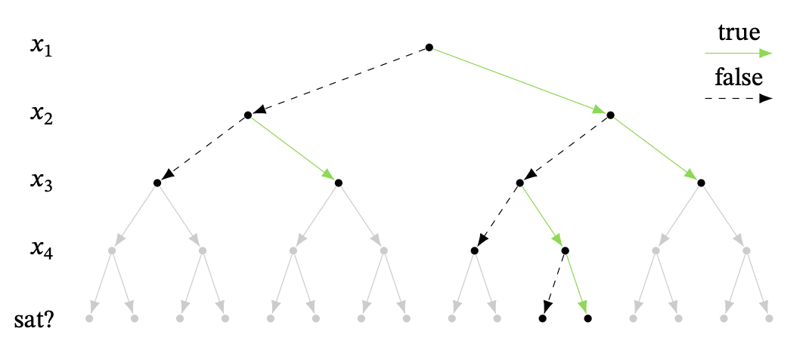

---
title: SAT-solving algorithms
...

# Overview

We've now seen why SAT solvers are useful and how to use them. In today's lecture, we'll talk about how they actually work.

# Improving brute force

To review, the problem is: Given a CNF with $n$ variables, how can you determine whether or not it is satisfiable? The most simple algorithm is to just try every assignment of variables, but there are $2^n$ assignments to check. For unsatisfiable formulas, this algorithm will always take exponential time!

One way to visualize this brute force algorithm is with a binary tree. Arbitrarily order the variables $x_1, x_2, \dots, x_n$. Starting at the top of the tree, we decide whether $x_1$ is true or false, then move on to $x_2$, and so on until we've decided every variable. Once we have picked all the variables, we plug them in to the formula and check if we guessed the right values. If not, we try some new guesses.

 

It is kind of like DFS. Once we get to a leaf, we backtrack and follow the next branch that we have not visited yet. 

This view of the tree search algorithm immediately suggests a natural way to make it faster. Instead of waiting until all variables have been decided to check whether or not the assignment works, check every time you make an assignment. If you can say that a partial assignment already doesn't work, you have eliminated an entire subtree!

Suppose our CNF has the clauses:

$$(x_1 \lor x_2) \qquad (\lnot x_2) \qquad (x_2 \lor x_3)$$

$$(x_2 \lor \lnot x_3 \lor x_4) \qquad (\lnot x_3 \lor \lnot x_4)$$

Suppose that by default, we pick false before true. That means we start by assigning $x_1$ false and $x_2$ false. This already contradicts the first clause!

Next, we try setting $x_2$ true. This contradicts $\lnot x_2$. So we go back up, having exhausted all options for $x_2$, and set $x_1$ true. By default, we first try $x_2$ false and $x_3$ false. That contradicts $(x_2 \lor x_3)$, and we continue. In the end, we find that the the formula is unsatisfiable, and we did not have to check any of the assignments in gray below!

Formally, our algorithm so far is the following:

1. Let $U = \emptyset$ be the set of assignments.
1. Traverse the tree as follows:
1. If $U$ makes any of the clauses in $\Delta$ false, and there is still an unexplored branch, revert $U$ to the latest decision for which we have not yet explored both the true and false branches. Recursively traverse the subtree from the unexplored branch. If there are no unexplored branches, return "unsatisfiable".
1. If $U$ is consistent with every clause individually, and there is an unset variable, pick one, set it to true/false, and add it to $U$. Recursively traverse the subtree from this branch. If all variables are already set, return "satisfiable" with $U$ as the satisfying assignment.

Note that although our example used a fixed variable order $x_1, \dots, x_n$, it would be equally sound algorithm to change the order in each branch. Thus, the formal description above allows you to change the variable order, which will be the case in all of the algorithms for SAT solving that we discuss.

# What else can be improved?

This was one example of a small improvement that we can make over a brute-force algorithm. In the lecture on Monday, we'll see a few more small improvements that make a big difference in the real-world running time of this algorithm (though, of course, still worst-case exponential time). Finding the best heuristics to make SAT solvers as efficient as possible remains an open and exciting area of research.