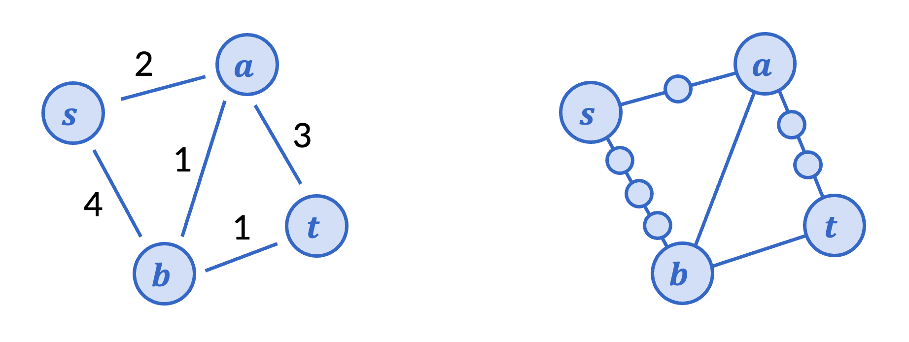

---
title: Shortest paths
...

# Priority queue

Recall from CSE 373 that a (min)-priority queue is an abstract data type similar to a queue that supports the following operations:

1. `add` an element to the queue at a given priority level in $O(\log n)$ time
1. `make` a priority queue from a list of length $n$ in $O(n)$ time
1. `extract` the element with lowest priority in $O(\log n)$ time
1. `peek` the element with lowest priority in $O(1)$ time
1. `decrease_priority` for a given element to a given new priority in $O(\log n)$ time.

Some of these running times can be improved with clever data structures, for example `decrease_priority` can be made to take amortized $O(1)$ time using a [Fibonacci heap](https://en.wikipedia.org/wiki/Fibonacci_heap), but we won't need these optimizations today, and you don't have to know them for this class.

# Dijkstra's algorithm

In CSE 373, you learned about Dijkstra's algorithm to compute shortest paths in a graph. Dijkstra's algorithm is a generalization of BFS shortest paths to weighted graphs. Depending on who you took 373 with, they may or may not have emphasized this connection!

Suppose you have a (undirected or directed) graph with positive integer edge weights (weights representing distance), and you wanted to find the length of the shortest path between two vertices.  If you didn't know any algorithms for weighted graphs, one thing you could do is replace every weighted edge with a path of that length, as in the picture below.



Then to find the length of the shortest path between $s$ and $t$, we could just run BFS on this expanded graph. Of course, this could be painfully slow if the edge weights were large numbers (say, in the thousands), but in principle, this is a possible algorithm. 

What actually happens with BFS on this graph? Among the original vertices, we discover $a$ first, in 2 layers. Then $b$ is discovered from $a$, in layer 3. Finally, $t$ is discovered in layer 4. 

Dijkstra's algorithm does exactly the same calculation, the only difference being that it jumps numbers instead of incrementing one by one. Upon processing $s$, we queue up $(a, 2)$ and $(b, 4)$, read as "$a$ would be in layer 2" and "$b$ would be in layer 4". Normal BFS would actually go through each layer. Dijkstra uses a priority queue (with the layer being the priority) to immediately know that $(a, 2)$ is the next vertex to be found by BFS, at layer 2. At $a$, we queue up $(t, 5)$ and update the priority of $(b, 3)$. Thus, we discover $b$ at layer 3 next, and so on.

The pseudocode itself is nearly identical to BFS with layers, the only notable difference being the use of a priority queue.

**Input:** A graph with vertices and edges and a starting vertex s.  
**Output:** An array that contains the distance from s to each vertex in the graph.

```
1. Set currPriority[s] = 0 and currPriority[x] = inf for all other x. 
2. Initialize a priority queue Q with every vertex at its priority above.
3. while Q is not empty:
4.     Get/remove the next vertex x from Q.
5.     for all outneighbors y of x:
6.         if currPriority[y] > currPriority[x] + dist(x, y):
7.             Update currPriority[y] = currPriority[x] + dist(x, y).
8.             Decrease the priority of y in Q to currPriority[y].
9. return currPriority
```

# Other shortest path algorithms

Besides BFS and Dijkstra's algorithm, there are two other shortest path algorithms that we'll cover in CSE 417: the Bellman-Ford algorithm, and A* search. 

The Bellman-Ford algorithm solves the problem of negative edge weights. Negative *distances* don't really make sense, but when edge weights model *cost*, negative edge weights indicate profit or gain, and thus still lead to many applications in practice. Nathan will cover this in the next unit.

In Monday's lecture, we'll also cover A* search. A* search will be the first example of a *heuristic* algorithm in this class. So far, we've only cared that our algorithm output matches a mathematical specification, and that its worst case running time is fast. But sometimes, specifications are more vague, or worst case running time doesn't happen very much in praactice. A* search computes the shortest path just like Dijkstra's algorithm, but is optimized to be faster on average when you can provide an "estimate" of how close you are to the goal. For example, if you were Google Maps trying to find the shortest route following roads, you can quickly compute the straight-line distance to the goal using the distance formula as the estimate. 