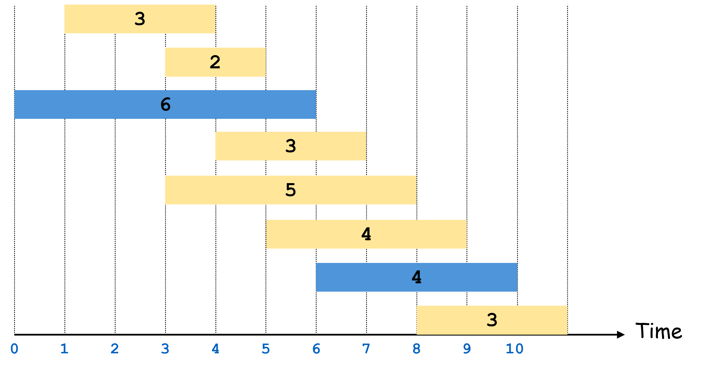

---
title: Weighted Interval Scheduling
...

During our last class we looked through several examples of dynamic programming algorithms. In this reading we will present another (weighted interval scheduling). This problem will show some intuitive similarities to one that we'll discuss next class, but that one will require a new technique for solving.

# Aside: Dynamic Programming vs. Brute Force

The "saving of subproblem solutions" (known as "memoization", note that there is no 'r' in that word) serves as the most important feature of dynamic programming algorithms. The suitability of a dynamic programming approach depends on the ability to dissect large problems into smaller subproblems which, throughout the entire process of solving, will repeat. Because of the repeated subproblems, saving the solutions results in a dramatic improvement in running time, typically from exponential (e.g. $2^n$) to polynomial (e.g. $O(n^k)$). Without this tactic of memoization, these algorithms would function just as a brute force approach (similar to the "choose explore unchoose" approach you may have seen in cse 123).

For this reason, to check that you dynamic programming algorithm is a good approach, it's worth double checking that you can reach the same subproblems in multiple different ways.

# Weighted Interval Scheduling

Suppose you have a party space that you are renting throughtout the day. You have received a bunch of bids from people who wish to throw a party in your space. These bids come with a start and end time (e.g. 8:00am - 9:10am) as well as the amount that rental would pay (e.g. $120).

We're going to use dynamic programming to design an algorithm to select events to maximize our rental income, without having any concurrently-booked events (for simplicity, we will assume it is fine for one event to end at the same time another begins).

Formally, we are given a list of $n$ bids. Each bid $b_i=(s_i, e_i, v_i)$ is represented as a triple of start time $s_i$, end time $e_i$, and value $v_i$. We define our input to be sorted by end time (i.e. $e_i\leq e_{i+1}$).

The figure below shows an example input for the 8 bids $[(1,4,3),(3,5,2),(0,6,6),(4,7,3),(3,8,5),(5,9,4),(6,10,4),(8,11,3)]$

![input $[(1,4,3),(3,5,2),(0,6,6),(4,7,3),(3,8,5),(5,9,4),(6,10,4),(8,11,3)]$](wis_input.png)

In this case, the best solution is to select bids $b_2=(0,6,6)$ and $b_6=(6,10,4)$ for a revenue of $10$.



## Designing the algorithm 

For this reading we will only look at the top-down solution. Recall from class that we recommended 2 steps for a top-down solution:

1. Identify a recursive structure
1. Design a memory for storing subproblems' solutions

Out tip for identifying the recursive structure is to consider the options for the last choice you might make when constructing a solution. For this algorithm, the choices we're making pertain to whether or not to include a particular bid in our solution. We can therefore design our recursive structure by considering the choice "should we include the last bid in our list, or exclude it?".

Once we make this choice, we need to identify what subproblem we would need to solve for each. 

**Including the last interval**

In the example given, suppose we chose to include the final bid $b_7=(8,11,3)$. We can observe a few conquences of this choice:

1. We gain 3 dollars of income from the rent
1. We need not consider any events with an end time after $8$ (because we sorted by end time, all of those will appear before $b_7$ in our list of bids)

This first observation tells us that whatever subproblem we solve next, we will add 3 to its income to account for selecting $b_7$. The second observation gives us a clue for which subproblem we might want to consider. The subproblem here should be the list of intervals ending with the last interval compatible with $b_7$. In short, we want to find the largest $b_i$ such that $e_i \leq s_7$, i.e. the last interval whose end time is less than or equal to the start time of the interval we just chose.

To summarize, selecting interval $b_7$ means that our best solution will be $wis(7)=v_7 + wis(i)$.

**Excluding the last interval**

Now, suppose we chose to exclude the final bid $b_7=(8,11,3)$. We can observe a few conquences of this choice:

1. We do not gain any rental income from this choice
1. We may still consider solutions containing any intervals before $b_7$.

For this case, our best solution is therefore going to be whatever is the best solution using all of indices $b_0$ through $b_6$, and so $wis(7)=wis(6)$.

Our overall answer should be whichever choice workd out to the best overall solution. Therefore, our final recursive structure will be $wis(7)=max(v_7 + wis(i), wis(6))$, or to generalize this: $wis(j)=max(v_j + wis(i), wis(j-1)$ where $i$ is the maximum index such that $e_i \leq s_j$.

## Memory Structure

Now that we've defined our recursive structure, let's take a look at how we might store our subproblem solutions. To do this we will observe how we identify each subproblem. In this case, each subproblem was identified by the index of a bid. Since there was one parameter used to identify a subproblem, we will have a 1-dimensional array to store solutions. The size of this array will be the number of different values that parameter might take. Since each index corresponds with one bid, that means the size of the array will be $n$, i.e. the number of bids.

## Top-Down Algorithm

We now have everything we need to provide a top-down algorithm:

```
def wis(bids):
    mem = array of -1s matching length of bids
    return wis(bids.length-1)

def wis(j):
    if(j == -1): // base case
        return 0;
    if(mem[j] > -1): // check if already solved
        return mem[j]
    excluded = wis(j-1) // case for excluding j
    i = j-1
    while(i > -1 and e_i > s_j): // find the next compatible event
        i--
    included = v_j + wis(i) // case for including j
    answer = max(excluded, included)
    mem[j] = answer
    return answer
```

Here, we selected the base case of $j=-1$ to indicate that there are no events under consideration, and so there is no rental income.

# Identifying the events

This algorithm above *almost* solves the problem we sought to solve. You may have noticed this already, but the algorithm above gives the *value* of the maximum income, not the set of events which achieve it. It turns out, though, that only a small change is necessary to enable us to do that! To help us, we will recognize that memory can be used to store anything we'd like. In addition to the value of subproblem solutions, we can also store notes one which choices we made in constructing each solution.

For this algorithm, in addition to storing the maximum revenue earned for evens up through $b_i$, we can also record whether the best solution ended up including it or excluding it. That is, we will have a second memory that looks the same as the first, except it records which choice was made at each step of our recursive structure.

Once we have this record of choices, we can "backtrace" through those choices to reconstruct the final solution. To see this in action, let's consider our original input above: $[(1,4,3),(3,5,2),(0,6,6),(4,7,3),(3,8,5),(5,9,4),(6,10,4),(8,11,3)]$. For this example, our array of choices would be $[T,F,T,T,F,T,T,F]$ where $T$ at $choices[i]$ represents that we made the choice to include bid $b_i$, and $F$ means we chose to exclude it. From here, we can use this $choices$ array along with knowledge of our recursive structure to identify which bids were used as follows:

- We begin looking at the last index, $7$. Because this is $F$ the best solution chose to exclude $b_7$. This means the subproblem used in this solution was $6$.
- Next we look at $choices[6]$. This is $T$, and so we included $6$ in the best solution. We next need to find the last event that ends at or before $s_6=6$. This is $b_2$.
- Next we look at $choices[2]$. This is $T$, and so we included $2$ in the best solution. We next need to find the last event that ends at or before $s_2=0$. In this case there is no such event, and so we're done. 

In the end, here's what our algorithm would look. Note that we only added the steps of recording the choices we make as we make them throughout our recursion, and then using the record of those choices to derive the actual bids chosen in the best answer.

```
def wis(bids):
    mem = array of -1s matching length of bids
    choices = array of booleans matching length of bids
    wis(bids.length-1)
    return findset(bids, choices)

def wis(j):
    if(j == -1): // base case
        return 0;
    if(mem[j] > -1): // check if already solved
        return mem[j]
    excluded = wis(j-1) // case for excluding j
    i = j-1
    while(i > -1 and e_i > s_j): // find the next compatible event
        i--
    included = v_j + wis(i) // case for including j
    answer = max(excluded, included)
    choices[j] = (answer == included) // T/F to indate whether we included event j
    mem[j] = answer
    return answer

def findset(bids, choices):
    bidSet = {}
    i = choices.length-1
    while(i>-1):
        if(!choices[i]):
            i--
        if(choices[i]):
            bidset.add(bids[i])
            start = s_i
            while(e_i > start):
                i--
    return bidset
```

