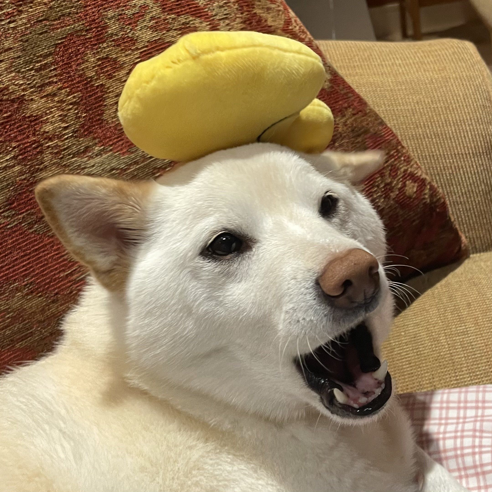
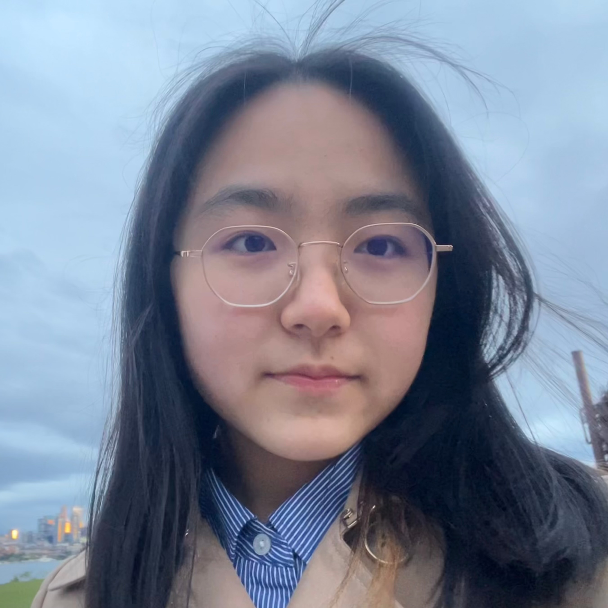
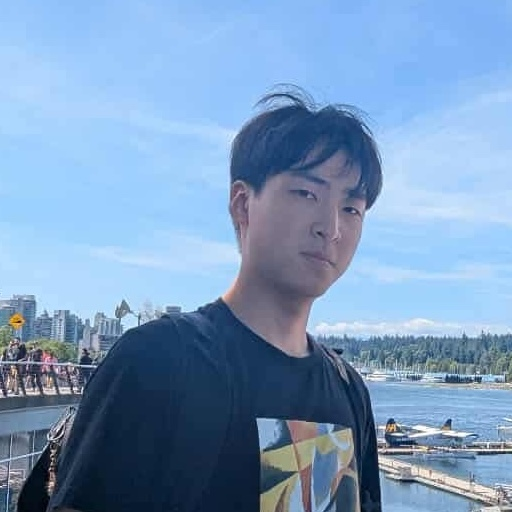

---
title: Staff
...

# Instructors

## Nathan Brunelle

## Glenn Sun

# TAs

## Zachary Bi

Hello y’all, my name is Zachary and I am a current junior. I am a big advocate for LeetCode and procrastination. In my free time I like to procrastinate and do LeetCode problems. I was originally pre: science (statistics intended) but switched into studying computer science, so feel free to reach out to me about that. I hope y’all have a great quarter and I look forward to meeting you all.

## Shayla Huang

Hi! I'm Shayla, and I'm a senior in computer science and math. Looking forward to meeting you all and hope you enjoy this course : D

## Katherine Elena Leavitt

Hi, I'm Katherine! I am a fourth year computer science student. This is my sixth time TA-ing, and my first time TA-ing an algorithms course. Outside of school you can find me rock climbing, swing dancing, and hitting the slopes⛷️. I am super excited to meet you all!

## Evan Wu

Hi everyone, I’m Evan! I’m a third-year Computer Engineering student and this is my first quarter TAing CSE 417! I've TAed for CSE 123, 373, and 311 before, and this will be my 6th quarter as a TA. Together, we will ball or bawl.

## Yuchen Xin

Hello! I'm Yuchen, a junior in CS. I'm proud of being able to type abcdefghijklmnopqrstuvwxyz in 1 second, and I'm down to do typing competitions with anybody. I also enjoy Lime scootering around random cities. Hope to have a good quarter with you all!
